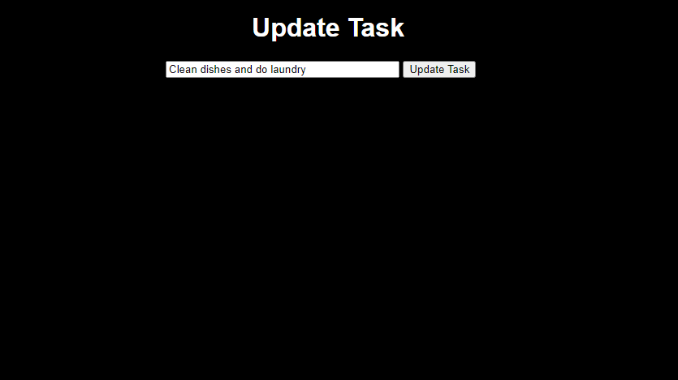
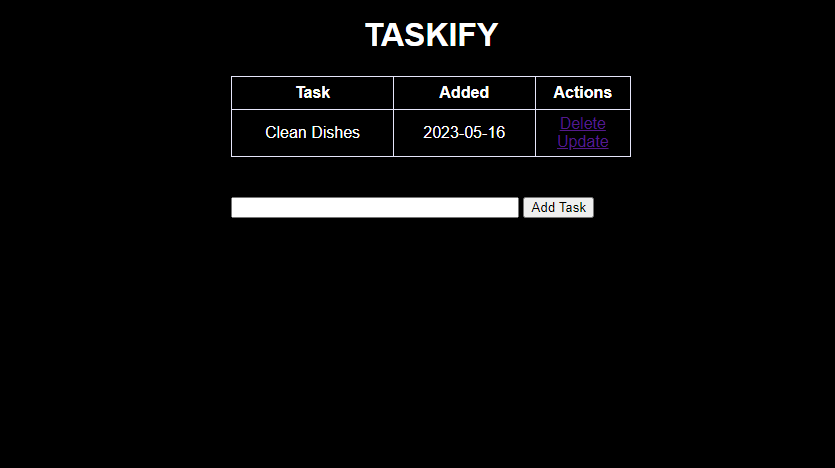

## Project Overview
This is a simple tasks website built using the Flask web framework. The website allows users to create, update, and delete tasks. 

## Features
* Create new tasks.
* Update existing tasks.
* Delete tasks.
* View a list of all tasks.

## Prerequisites
Before running the tasks website, make sure you have the following installed:

* Python (version 3.6 or later)
* Flask (version 2.0 or later)

## Installation
1. Clone the repository or download the source code.
```bash
git clone https://github.com/silentwraith03/taskify.git
```
2. Navigate to the project directory.
```bash
cd taskify
```
3. Create a virtual environment.
```bash
python -m venv venv
```
4. Activate the virtual environment.
* For Windows
```bash
venv\Scripts\activate
```
* For Linux
```bash
source venv/bin/activate
```
5. Start the development server
```bash
python app.py
```
6. Open your web browser and visit http://localhost:5000/ to access the tasks website

## Project Structure
```arduino
taskify/
  |- images/
  |- instance/
  |- static/
  |- templates/
  |- app.py
  |- .env
  |- .flaskenv
  |- README.md
```

## Screenshots




## Tech Used
* Python
* Flask
* Flask-SQLAlchemy
* HTML
* CSS
* JavaScript

## License
[MIT](LICENSE)